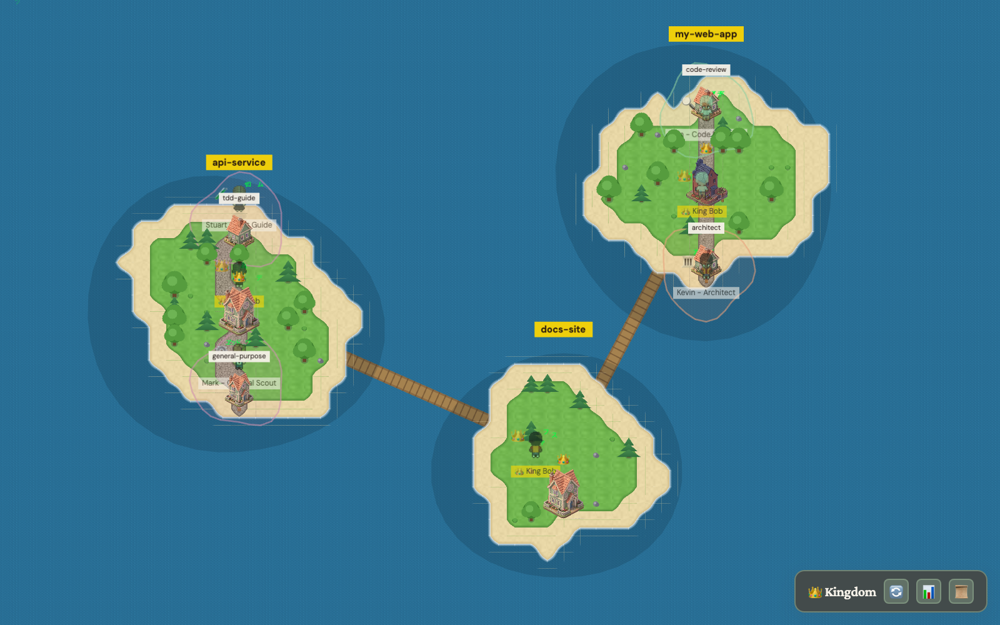
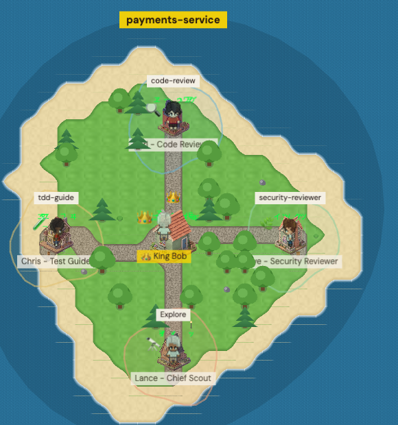

# 👑 Kingdom Dashboard

[](LICENSE)
[](https://nodejs.org)
[](https://phaser.io)

A real-time, top-down **island kingdom** that visualizes your live Claude Code sessions. Every
session is an island; the main agent is **King Bob**, and the subagents he spawns are villagers who
appear, work, and leave. It runs entirely on your machine off a single status file that Claude Code
hooks keep up to date — no accounts, no network calls, nothing leaves your laptop.



> *Three live Claude Code sessions rendered as islands. Each has its King Bob; villagers (subagents)
> work in the houses; wooden bridges link neighbouring islands.*

## What it is

Claude Code can run many sessions at once, and each session can spawn a swarm of subagents — but a
terminal gives you no sense of that shape. This dashboard turns the invisible into a **living map**:

- You glance at it and instantly see **how many sessions are running**, **which one is busy**, and
  **how many subagents each has spawned**.
- It's **passive and read-only** — it never drives Claude, only mirrors it. Closing the dashboard
  changes nothing about your sessions.
- It's **local-first** — the only input is a JSON file on your own disk. No cloud, no login,
  no telemetry.

Think of it as a `htop` for your Claude Code fleet, drawn as a cozy top-down game.

## The kingdom

- **King Bob** — the persona of the main agent in each session ("Chief Minion"). He resides on his
  island and calls you *"my lord."*
- **Islands** — one per live Claude Code session. Start a session and an island rises from the sea;
  end it and the island sinks.
- **Villagers** — the subagents (`Task`/`Agent`) King Bob spawns. They animate with the tool
  they're currently running and depart when the task completes.

Sessions are laid out as a scattered archipelago with autotiled sand/grass coastlines, curved cobble
roads linking the workspace houses, and wooden bridges between neighbouring islands.

## The monitor — what you're looking at



Every element on the map maps to something real in your session:

- **Island label** (the yellow tag) — the session's working directory name, so you can tell your
  islands apart at a glance.
- **King Bob's throne** — the centre of each island. Its presence means the main agent (the
  top-level conversation) is alive.
- **Villager + house** — one per running subagent. Each is labelled with its **agent type**
  (`code-review`, `security-reviewer`, `tdd-guide`, `Explore`, …) and a fun in-kingdom name/role.
  The villager animates according to the **tool it is currently running** (reading, editing,
  searching, running a command).
- **Cobble roads** — connect each villager's house back to King Bob's throne: the subagents
  belong to that session.
- **Wooden bridges** — link neighbouring islands, tying the archipelago into one kingdom.
- **Rising / sinking islands** — start a session and an island rises from the sea; end it and the
  island sinks. Villagers arrive when a subagent starts and depart when it finishes.
- **Toolbar** (bottom-right) — refresh, a live stats panel (working-agent counts), and view
  controls. You can also pan and zoom the map freely.

The whole scene refreshes about once a second, so it stays in lock-step with what Claude Code is
actually doing right now.

<br clear="all" />

## How it works

```
Claude Code hook fires (session start/end, agent start/stop, any tool use)
        │
        ▼
hook rewrites  ~/.claude/agent-status.json   ({ "agents": [ ... ] })
        │
        ▼
Express (server/index.js) serves it at  GET /api/status
        │
        ▼
browser polls every 1s → Phaser adds / animates / removes islanders
```

Simple polling — no websockets, no file watchers, no race conditions. You can inspect
`~/.claude/agent-status.json` directly at any time.

## Prerequisites

- Node.js ≥ 18
- [Claude Code](https://claude.ai/code) installed
- `jq` (used by the hooks and installer) — `brew install jq` / `apt-get install jq`
- macOS or Linux (Windows untested)

## Quick start

```bash
git clone <your-fork-url> claude-kingdom-dashboard
cd claude-kingdom-dashboard

./setup.sh          # installs hooks + King Bob into ~/.claude, merges settings.json (backup made)
npm install
npm run dev         # server on :3001, Vite dev server on :5173
```

Then **start (or restart) a Claude Code session** so the hooks load. King Bob appears on a fresh
island within ~1 second; spawn a subagent and a villager joins him.

Production-style run:

```bash
npm run build       # always from the repo root, not client/
npm run server      # http://localhost:3001
```

> Setting up with Claude? Point it at [`CLAUDE.md`](./CLAUDE.md) — it's a step-by-step setup guide
> written for the assistant.

## What `setup.sh` does

1. Copies the hooks in [`hooks/`](./hooks) into `~/.claude/hooks/` and marks them executable.
2. Copies [`assets/king-bob.png`](./assets) into `~/.claude/minion-emojis/`.
3. Merges the hook wiring into `~/.claude/settings.json`, after saving a timestamped `.bak`.

It is **idempotent** (safe to re-run) and **non-destructive** — it never removes hooks you already
have. The hooks it installs:

| Event | Matcher | Hook | Effect |
|-------|---------|------|--------|
| SessionStart | `""` | `session-start-kingdom.sh` | raises King Bob's island + sets the persona |
| SessionEnd | — | `session-end-kingdom.sh` | sinks the island |
| PreToolUse | `Agent`, `Task` | `agent-start.sh` | a villager arrives |
| PreToolUse | `.*` | `update-agent-tool.sh` | heartbeat + current-tool animation |
| PostToolUse | `Agent`, `Task` | `agent-complete.sh` | a villager departs |

## Configuration

Copy `.env.example` to `.env` to override defaults:

- `PORT` (default `3001`)
- `AGENT_STATUS_FILE` (default `~/.claude/agent-status.json`)
- `CORS_ORIGIN` (default `*`)

## Make Claude behave like the kingdom (optional)

The dashboard only *shows* your sessions. If you also want your Claude to *act* like King Bob's
kingdom, the [`kingdom/`](./kingdom) folder has two work-free extras:

- **[`kingdom/global-CLAUDE.md`](./kingdom/global-CLAUDE.md)** — a sanitized version of the kingdom's
  persona + working rules. Copy it into your global `~/.claude/CLAUDE.md` (merge by hand if you
  already have one — don't overwrite).
- **[`kingdom/PLUGINS.md`](./kingdom/PLUGINS.md)** — the public Claude Code plugins the kingdom uses,
  with copy-paste `/plugin` install commands. All public; install what you actually use.

## Customizing

- **Persona** — edit the `additionalContext` string in `hooks/session-start-kingdom.sh`, then
  re-run `./setup.sh`. Change the name, the honorific, or remove it entirely.
- **King Bob's face** — swap `assets/king-bob.png` and re-run `./setup.sh`.
- **Look & feel** — rendering is in `client/phaser/`; palette and fonts in `client/index.html`.

## Project structure

```
claude-kingdom-dashboard/
├── CLAUDE.md               # setup guide for the assistant
├── setup.sh                # installs hooks + King Bob, merges settings.json
├── hooks/                  # the Claude Code hooks that drive the dashboard
├── assets/king-bob.png     # King Bob's portrait
├── docs/screenshots/       # images used in this README
├── kingdom/                # optional: persona rules + public plugin list
├── server/index.js         # Express: serves the build + GET /api/status
├── client/
│   ├── index.html
│   ├── main.js
│   └── phaser/             # scenes, entities, managers, island tile generator
├── public/                 # generated terrain tiles, sprites, building art
├── scripts/generate-tiles.mjs
└── vite.config.js
```

## Troubleshooting

- **No islands** — check `~/.claude/agent-status.json` exists and grows as you use tools, that the
  hooks in `~/.claude/hooks/` are executable, and that you started a *new* session after setup. See
  `~/.claude/hooks/debug.log`.
- **Port in use** — `lsof -ti:3001 | xargs kill`, or set `PORT` in `.env`.
- **Build errors** — `rm -rf node_modules package-lock.json && npm install`; ensure Node ≥ 18.

## License

MIT — see [LICENSE](LICENSE).
